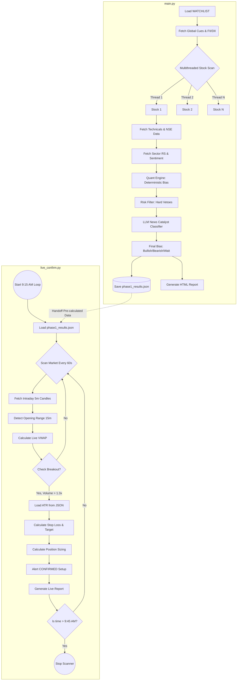

# Trading Market Analyzer - Architecture Flow

This document outlines the dual-phase architecture of the NSE day-trading system.

```mermaid
graph TD
    %% Phase 1: Pre-Market Analysis
    subgraph Phase 1: Pre-Market Analyzer [main.py]
        A[Load WATCHLIST] --> B(Fetch Global Cues & FII/DII)
        B --> C{Multithreaded Stock Scan}
        
        C -->|Thread 1| D1[Stock 1]
        C -->|Thread 2| D2[Stock 2]
        C -->|Thread N| D3[Stock N]
        
        D1 --> E[Fetch Technicals & NSE Data]
        E --> F[Fetch Sector RS & Sentiment]
        F --> G[Quant Engine: Deterministic Bias]
        G --> H[Risk Filter: Hard Vetoes]
        H --> I[LLM News Catalyst Classifier]
        I --> J[Final Bias: Bullish/Bearish/Wait]
        
        J --> K[(Save phase1_results.json)]
        J --> L[Generate HTML Report]
    end

    %% Phase 2: Live Market Confirmation
    subgraph Phase 2: Live Confirmation Engine [live_confirm.py]
        M((Start 9:15 AM Loop)) --> N[Load phase1_results.json]
        N --> O{Scan Market Every 60s}
        
        O --> P[Fetch Intraday 5m Candles]
        P --> Q[Detect Opening Range 15m]
        Q --> R[Calculate Live VWAP]
        R --> S{Check Breakout?}
        
        S -->|Yes, Volume > 1.3x| T[Load ATR from JSON]
        S -->|No| O
        
        T --> U[Calculate Stop Loss & Target]
        U --> V[Calculate Position Sizing]
        V --> W[Alert CONFIRMED Setup]
        W --> X[Generate Live Report]
        
        X --> Y{Is time > 9:45 AM?}
        Y -->|No| O
        Y -->|Yes| Z((Stop Scanner))
    end
    
    K -.->|Handoff Pre-calculated Data| N
```
