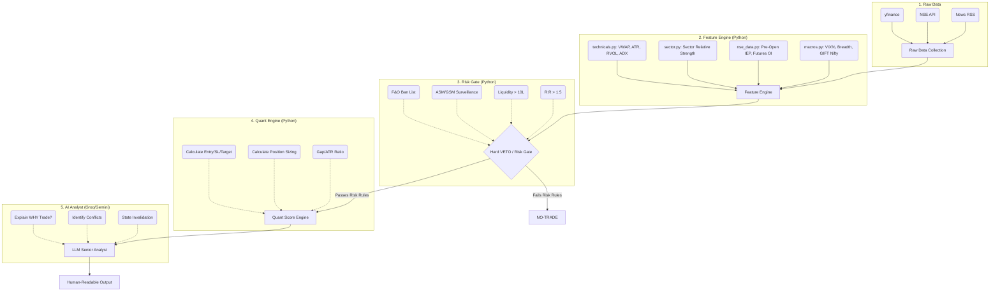

# NSE Pre-Market Analyzer: System Requirements & Parameters Specification

This document details the complete architecture, data parameters, and data sources for the NSE Pre-Market Python Analyzer. This ensures the AI model receives a 360-degree view of the market before generating a trading plan at 9:10 AM.

## Architecture: The Quant + AI Hybrid Model

In response to a 66-point review, the system architecture was overhauled from a simple `Data → LLM → Trade` pipeline into a professional 5-stage institutional model.

### Data Flow Diagram

### The 5 Stages of Execution

1. **Feature Engine (`technicals.py`, `sector.py`, `nse_data.py`, `macros.py`)**
   - Collects all necessary data and calculates technical/statistical features (e.g., VWAP, ATR, RVOL, Gap/ATR ratio, relative strength vs sector).

2. **Hard VETO / Risk Gate (`risk_filter.py`)**
   - **Critical Rule:** If a stock triggers a hard veto (e.g., in F&O ban, under ASM/GSM, lacks minimum liquidity, or has a Risk:Reward ratio below 1.5), the trade is **instantly rejected**. The LLM is never called, saving tokens and preventing catastrophic trades.

3. **Quant Engine (`quant_engine.py`)**
   - Deterministically calculates all price levels using ATR, CPR, and structural support/resistance.
   - Calculates exact position sizing based on `TRADING_CAPITAL` and `RISK_PER_TRADE_PERCENT` set in `config.py`.
   - **Critical Rule:** LLMs are explicitly forbidden from generating prices; they hallucinate.

4. **LLM as Senior Analyst (`llm.py`)**
   - The LLM receives the pre-calculated quant levels and all feature data.
   - Its job is to interpret the evidence, identify conflicting signals, explain the strongest bullish/bearish case, and state what would invalidate the setup.

5. **Reporting (`report.py`)**
   - Aggregates the signals, quant levels, risk warnings, and LLM reasoning into a highly readable HTML dashboard.

## 1. Technical Data & Price Action
**Source:** `yfinance` (Yahoo Finance API)
**Module:** `core/technicals.py`
**Parameters Analyzed:**
*   **Current Price:** Last traded price (LTP).
*   **52-Week High & Low:** To check if the stock is near major historical resistance/support.
*   **RSI (Relative Strength Index - 14 Day):** To identify overbought (>70) or oversold (<30) momentum.
*   **EMA-20 (Exponential Moving Average):** To determine the short-term baseline trend.
*   **PDH & PDL (Previous Day High/Low):** Crucial intraday breakout/breakdown levels.
*   **CPR (Central Pivot Range):** 
    *   *Top Central Pivot (TC)*
    *   *Central Pivot (Pivot)*
    *   *Bottom Central Pivot (BC)*
    *   (Used to identify if the day will be trending or sideways based on CPR width).

## 2. Live NSE Pre-Open & Derivatives Data
**Source:** NSE India Official API / `nsepython`
**Module:** `core/nse_data.py`
**Parameters Analyzed:**
*   **IEP (Indicative Equilibrium Price):** The exact price the stock will open at 9:15 AM (captured between 9:08 - 9:14 AM).
*   **Pre-Open Gap %:** The exact percentage the stock is gapping up or down.
*   **Pre-Open Order Imbalance:** The ratio of buy orders vs. sell orders pending in the pre-open session.
*   **Delivery Percentage (T-1):** The percentage of shares actually taken for delivery yesterday (high delivery = strong institutional conviction).
*   **Options Chain Data:**
    *   Net Change in Call Open Interest (Resistance buildup).
    *   Net Change in Put Open Interest (Support buildup).
    *   PCR (Put-Call Ratio) for sentiment bias.

## 3. Global Macros & Indices (Overnight Cues)
**Source:** `yfinance` (Global Index Tickers)
**Module:** `core/macros.py`
**Parameters Analyzed:**
*   **S&P 500 (`^GSPC`) & NASDAQ (`^IXIC`):** Overnight US closing performance to gauge global risk-on/risk-off sentiment.
*   **India VIX (`^INDIAVIX`):** Volatility Index. High VIX (>15) indicates fear and larger intraday swings.
*   **Nifty 50 (`^NSEI`) & Bank Nifty (`^NSEBANK`):** Broader Indian market trend.
*   **Commodities & Currency:** Crude Oil (`CL=F`), Gold (`GC=F`), and USD/INR (`INR=X`) to track inflation and currency pressures affecting specific sectors (like Airlines, Paints, IT).

## 4. Sentiment & Institutional Flow
**Source:** Google News RSS API & NSE Institutional Data
**Module:** `core/sentiment.py`
**Parameters Analyzed:**
*   **FII Cash Flow (Foreign Institutional Investors):** Net Buy/Sell value from the previous session (in Crores).
*   **DII Cash Flow (Domestic Institutional Investors):** Net Buy/Sell value from the previous session.
*   **Live News Feed:** Top 2 to 3 most recent news headlines specifically tagged to the stock ticker within the last 24 hours.

## 5. The AI Trading Brain (LLM Engine)
**Source:** Groq API (`openai/gpt-oss-120b`) / Gemini API (`gemini-3.5-flash-lite`)
**Module:** `core/llm.py`
**Parameters Evaluated by AI:**
The AI takes the above 4 data silos and scores the stock on a scale of -10 to +10 using a 5-Pillar Matrix:
1.  **Trend Score:** Price action vs EMA/CPR.
2.  **Derivatives Score:** Short covering vs fresh buildup.
3.  **Catalyst Score:** News impact (Includes a VETO rule: if news is fatally bad, longs are hard-blocked).
4.  **Market Regime Score:** Nifty & Global tailwinds/headwinds.
5.  **Pre-Open Strength Score:** Delivery volume and IEP gap.

**Final Generated Output for User:**
*   **Signal:** GO LONG, GO SHORT, WAIT, or NO-TRADE.
*   **Confidence:** High, Medium, Low.
*   **Trade Plan:** Exact entry price, target price, and stop-loss invalidation level.
